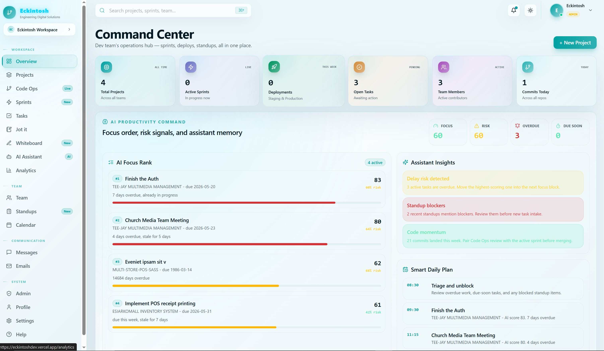
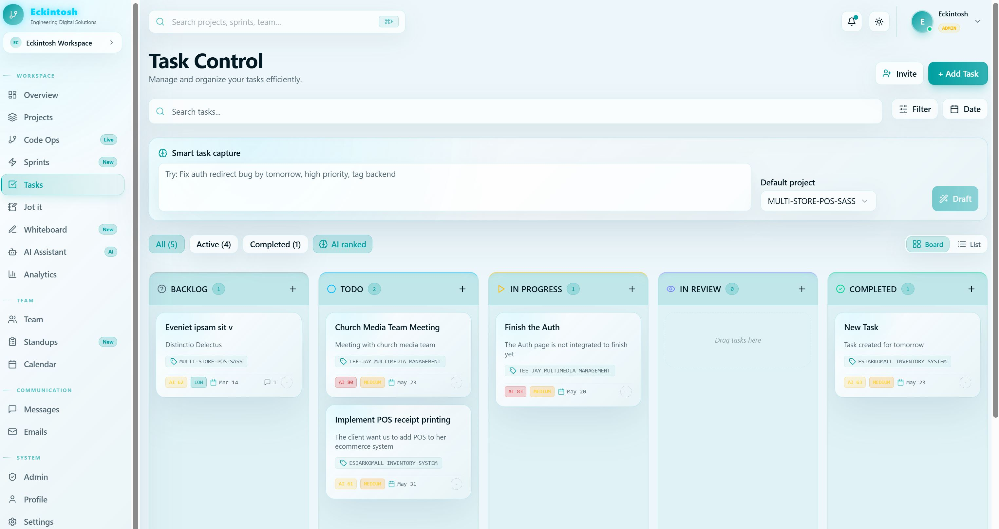
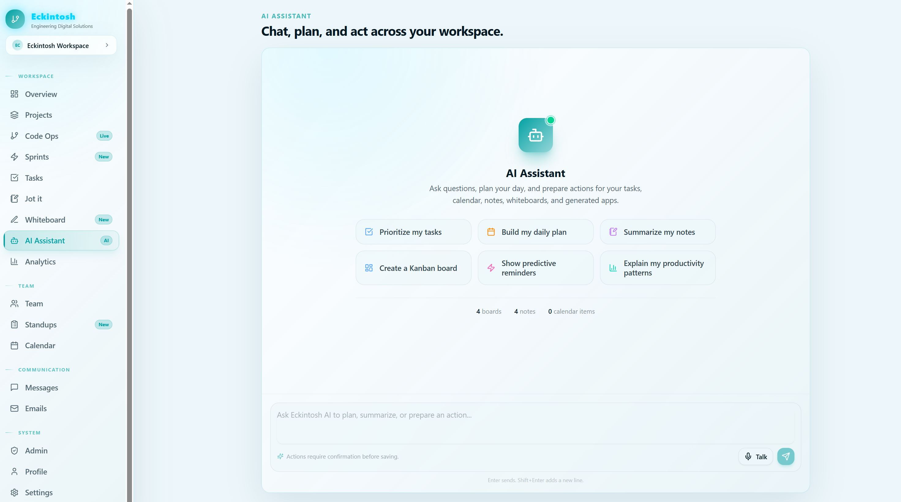
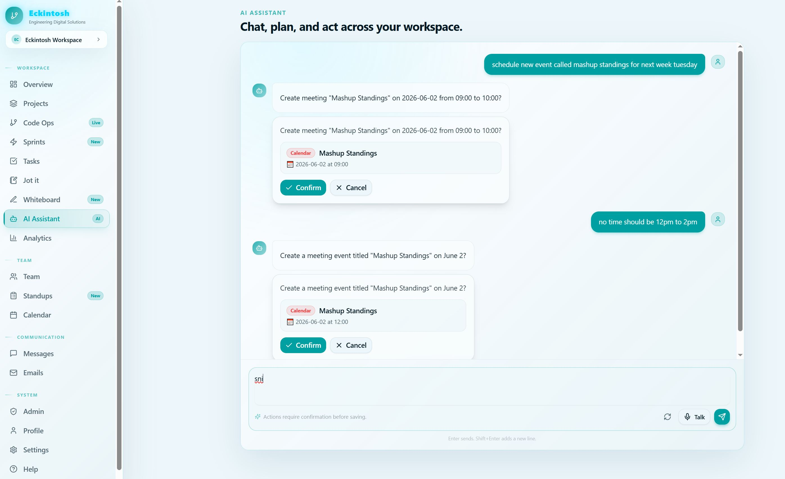
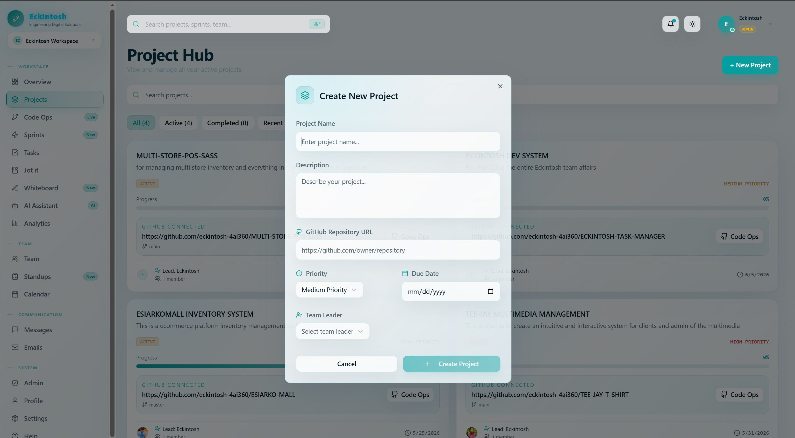
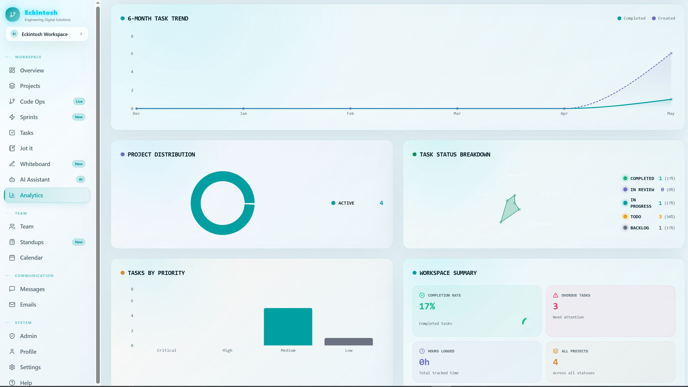
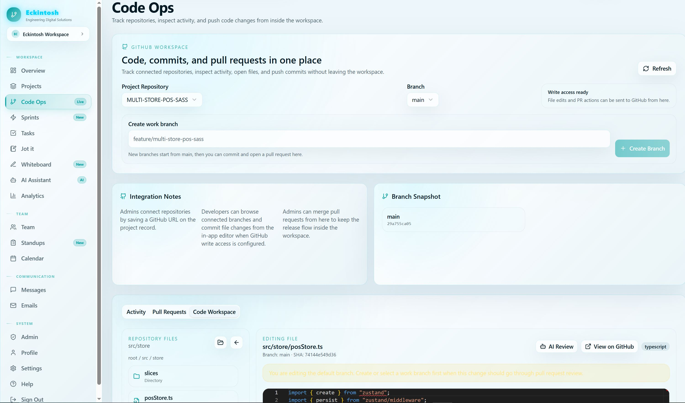
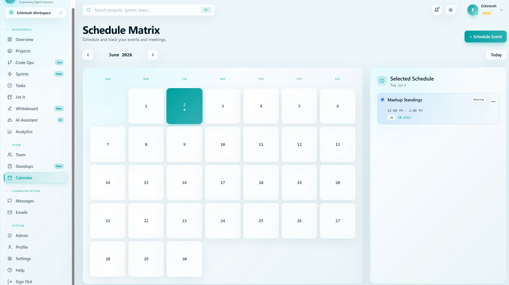

<h1 align="center">
  <br />
  Eckintosh Task Manager
  <br />
</h1>

<p align="center">
  A full-stack project management platform built for developers — with real-time messaging, sprint tracking, AI assistance, whiteboards, and more.
</p>

<p align="center">
  
  
  
  
  
  
</p>

---

## 📸 Screenshots

> _Screenshots coming soon — drop yours into this section!_

<!--
  Replace the placeholders below with your actual screenshot paths:
  
  
  
  
  
  
  
  

-->

---

## ✨ Features

### 🗂️ Project & Task Management

- Create and manage **projects** with colour-coded labels, tech stacks, priority levels, and progress tracking
- Full **task lifecycle** — Backlog → To Do → In Progress → In Review → Completed → Archived
- **Subtasks**, **comments**, **tags**, **due dates**, and **time estimates** per task
- **Time tracking** with per-task time entries

### 🏃 Agile Sprints

- Create sprints with goals, start/end dates, and status (Planning → Active → Completed)
- Assign tasks to sprints and track velocity across cycles

### 📅 Calendar

- Unified calendar view for tasks, meetings, deadlines, sprint events, and releases

### 💬 Real-time Messaging

- Direct messages powered by a **native WebSocket server** (no third-party service)
- Rich message features: **replies**, **edits**, **deletes**, and **media attachments** (image, video, audio, document)
- Live **online presence** indicators

### 📣 Standups

- Log daily standups: _what you did yesterday_, _what you're doing today_, _blockers_, and a **mood tracker**
- Scoped per project

### 📊 Analytics

- Per-project analytics: tasks completed, total tasks, time spent, team size, and sprint velocity

### 🤖 AI Assistant

- Integrated **Groq AI** assistant for in-app help and task guidance

### 🖊️ Whiteboard

- Full **Excalidraw** integration for collaborative diagramming and freehand drawing
- Auto-saves with thumbnail preview

### 📝 Jot It (Notes)

- Quick personal notes with colour coding, pinning, and archiving
- Rich-text editing powered by **TipTap**

### 📧 Internal Email

- In-app email system between team members

### 🔔 Notifications

- **Push notifications** (Web Push / VAPID) and **email notifications** (Resend or SMTP)
- Granular preference controls: task reminders, team updates, daily digest, overdue escalation, quiet hours

### 👥 Team Management

- Manage teams and project members with roles: `lead`, `backend`, `frontend`, `design`, `devops`, `member`
- Role-based access control (RBAC): `ADMIN`, `USER`, `GUEST`

### 🔗 GitHub Integration

- Link repositories to projects (GitHub, GitLab, Bitbucket)
- Commit and deployment tracking per project

### 🔐 Authentication

- **GitHub OAuth** via NextAuth.js v5 with JWT sessions
- Custom credential-based login with **bcrypt** password hashing
- Email verification with **OTP** support

### ⚙️ Settings & Admin

- User profile, timezone, and notification preferences
- Admin panel for platform-wide management

---

## 🛠️ Tech Stack

| Layer                  | Technology                                                         |
| ---------------------- | ------------------------------------------------------------------ |
| **Framework**          | [Next.js 16](https://nextjs.org/) (App Router)                     |
| **Language**           | TypeScript 5                                                       |
| **Runtime**            | React 19                                                           |
| **Database**           | PostgreSQL via [Neon](https://neon.tech/) (serverless)             |
| **ORM**                | [Prisma 7](https://www.prisma.io/)                                 |
| **Auth**               | [NextAuth.js v5](https://authjs.dev/) (GitHub OAuth + Credentials) |
| **Real-time**          | Native WebSocket (`ws`) server                                     |
| **Styling**            | [Tailwind CSS v4](https://tailwindcss.com/)                        |
| **UI Components**      | [Radix UI](https://www.radix-ui.com/) + shadcn/ui                  |
| **Rich Text**          | [TipTap](https://tiptap.dev/)                                      |
| **Code Editor**        | [Monaco Editor](https://microsoft.github.io/monaco-editor/)        |
| **Whiteboard**         | [Excalidraw](https://excalidraw.com/)                              |
| **Charts**             | [Recharts](https://recharts.org/)                                  |
| **AI**                 | [Groq SDK](https://groq.com/)                                      |
| **Email**              | [Resend](https://resend.com/) / Nodemailer (SMTP fallback)         |
| **Push Notifications** | Web Push (VAPID)                                                   |
| **Drag & Drop**        | [@hello-pangea/dnd](https://github.com/hello-pangea/dnd)           |
| **Forms**              | React Hook Form + Zod                                              |
| **Deployment**         | [Vercel](https://vercel.com/)                                      |

---

## 🚀 Getting Started

### Prerequisites

- **Node.js** 18+ and **npm** 10+
- A **PostgreSQL** database (recommended: [Neon](https://neon.tech/) for serverless)
- A **GitHub OAuth App** ([create one here](https://github.com/settings/developers))
- Optional: [Resend](https://resend.com/) account for email notifications

---

### 1. Clone the repository

```bash
git clone https://github.com/your-username/eckintosh-task-manager.git
cd eckintosh-task-manager
```

---

### 2. Install dependencies

```bash
npm install
```

---

### 3. Configure environment variables

Copy the example file and fill in your values:

```bash
cp .env.example .env
```

```env
# ─── Database ────────────────────────────────────────────────────────────────
DATABASE_URL=""           # Pooled connection string (Neon / pg)
DIRECT_URL=""             # Direct (non-pooled) connection string
DATABASE_URL_UNPOOLED=""  # Unpooled URL for migrations

# ─── Auth ─────────────────────────────────────────────────────────────────────
JWT_SECRET=""             # Secret for custom JWT sessions
AUTH_SECRET=""            # NextAuth.js secret (required in production)
AUTH_URL="http://localhost:3000"

# ─── GitHub OAuth ─────────────────────────────────────────────────────────────
GITHUB_ID=""              # GitHub OAuth App Client ID
GITHUB_SECRET=""          # GitHub OAuth App Client Secret

# ─── App ──────────────────────────────────────────────────────────────────────
NEXT_PUBLIC_APP_URL="http://localhost:3000"

# ─── Push Notifications ───────────────────────────────────────────────────────
NEXT_PUBLIC_VAPID_PUBLIC_KEY=""
VAPID_PRIVATE_KEY=""
VAPID_SUBJECT="mailto:you@example.com"

# ─── Email (Resend) ───────────────────────────────────────────────────────────
RESEND_API_KEY=""
NOTIFICATION_FROM_EMAIL="notifications@yourdomain.com"
NOTIFICATION_FROM_NAME="Your App Notifications"

# ─── SMTP fallback (if not using Resend) ─────────────────────────────────────
SMTP_HOST=""
SMTP_PORT="587"
SMTP_SECURE="false"
SMTP_USER=""
SMTP_PASSWORD=""

# ─── GitHub Workspace Integration ─────────────────────────────────────────────
GITHUB_ACCESS_TOKEN=""
GITHUB_WEBHOOK_SECRET=""
```

> **Tip:** Generate VAPID keys with:
>
> ```bash
> npx web-push generate-vapid-keys
> ```

---

### 4. Set up the database

```bash
# Apply the schema and generate the Prisma client
npx prisma db push
npx prisma generate

# (Optional) Seed with sample data
npx tsx prisma/seed.ts
```

---

### 5. Run the development server

```bash
npm run dev
```

Open [http://localhost:3000](http://localhost:3000) in your browser.

The custom server also starts a **WebSocket endpoint** at `ws://localhost:3000/ws` for real-time messaging.

---

## 📦 Available Scripts

| Script                    | Description                                         |
| ------------------------- | --------------------------------------------------- |
| `npm run dev`             | Start the dev server (Next.js + WebSocket)          |
| `npm run build`           | Build for production (runs `prisma generate` first) |
| `npm start`               | Start the production server                         |
| `npm run lint`            | Run ESLint                                          |
| `npm run prisma:generate` | Regenerate the Prisma client                        |

---

## ☁️ Deploying to Vercel

1. Push your code to GitHub.
2. Import the repository into [Vercel](https://vercel.com/).
3. Add **all environment variables** from `.env.example` in the Vercel dashboard under **Settings → Environment Variables** (select the **Production** scope).
4. Set your GitHub OAuth App's **Authorization callback URL** to:
   ```
   https://your-domain.vercel.app/api/auth/callback/github
   ```
5. Redeploy.

> **Verify auth is working** by visiting `https://your-domain.vercel.app/api/auth/providers` — it should return a `github` object, not `{}`.

---

## 🔐 Roles & Permissions

| Role    | Access                            |
| ------- | --------------------------------- |
| `ADMIN` | Full platform access, admin panel |
| `USER`  | Standard access to all features   |
| `GUEST` | Read-only, limited feature access |

Project members also have sub-roles: `lead`, `backend`, `frontend`, `design`, `devops`, `member`.

---

## 🤝 Contributing

Contributions, issues, and feature requests are welcome!

1. Fork the repository
2. Create a new branch: `git checkout -b feature/your-feature`
3. Commit your changes: `git commit -m 'feat: add your feature'`
4. Push to the branch: `git push origin feature/your-feature`
5. Open a Pull Request

---
